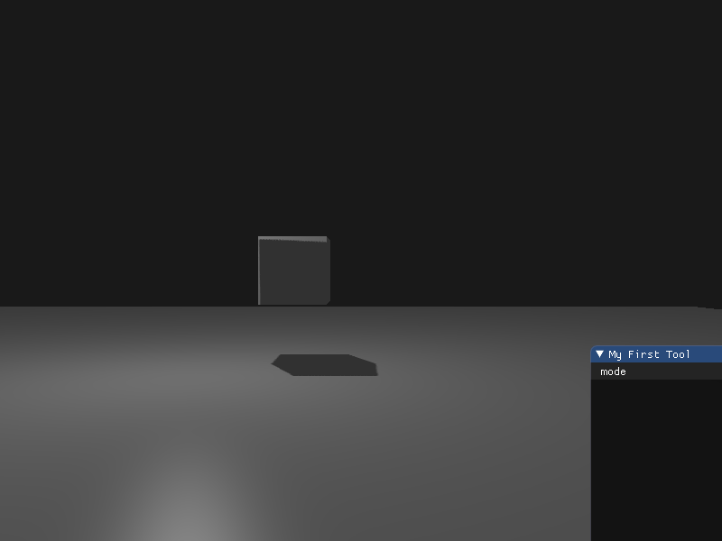

# Homework 7

## Basic:

### 实现方向光源的Shadowing Mapping

#### 要求场景中至少有一个object和一块平面(用于显示shadow)

创建正方体和正方形平面用于显示

```c++
unsigned int cubeVBO, cubeVAO;
	glGenVertexArrays(1, &cubeVAO);
	glGenBuffers(1, &cubeVBO);
	glBindVertexArray(cubeVAO);
	glBindBuffer(GL_ARRAY_BUFFER, cubeVBO);
	glBufferData(GL_ARRAY_BUFFER, sizeof(vertices), vertices, GL_STATIC_DRAW);
	glVertexAttribPointer(0, 3, GL_FLOAT, GL_FALSE, 6 * sizeof(float), (void *)0);
	glEnableVertexAttribArray(0);
	glVertexAttribPointer(1, 3, GL_FLOAT, GL_FALSE, 6 * sizeof(float), (void *)(3 * sizeof(float)));
	glEnableVertexAttribArray(1);
	glBindVertexArray(0);
 ...
```

#### 光源的投影方式任选其一即可

使用平行光源, 即使用正交投影实现深度贴图

首先创建深度纹理, 配置延展, 缩放等参数

```c++
unsigned int depthMap;
glGenTextures(1, &depthMap);
glBindTexture(GL_TEXTURE_2D, depthMap);
glTexImage2D(GL_TEXTURE_2D, 0, GL_DEPTH_COMPONENT, SHADOW_WIDTH, SHADOW_HEIGHT, 0, GL_DEPTH_COMPONENT, GL_FLOAT, NULL);
glTexParameteri(GL_TEXTURE_2D, GL_TEXTURE_MIN_FILTER, GL_NEAREST);
glTexParameteri(GL_TEXTURE_2D, GL_TEXTURE_MAG_FILTER, GL_NEAREST);
glTexParameteri(GL_TEXTURE_2D, GL_TEXTURE_WRAP_S, GL_CLAMP_TO_BORDER);
glTexParameteri(GL_TEXTURE_2D, GL_TEXTURE_WRAP_T, GL_CLAMP_TO_BORDER);
float borderColor[] = { 1.0, 1.0, 1.0, 1.0 };
glTexParameterfv(GL_TEXTURE_2D, GL_TEXTURE_BORDER_COLOR, borderColor);
glBindFramebuffer(GL_FRAMEBUFFER, depthMapFBO);
glFramebufferTexture2D(GL_FRAMEBUFFER, GL_DEPTH_ATTACHMENT, GL_TEXTURE_2D, depthMap, 0);
glDrawBuffer(GL_NONE);
glReadBuffer(GL_NONE);
glBindFramebuffer(GL_FRAMEBUFFER, 0);
```

使用正交投影转换光源空间

```c++
glm::mat4 lightProjection = glm::ortho(-10.0f, 10.0f, -10.0f, 10.0f, 1.0f, 20.0f);
glm::mat4 lightView = glm::lookAt(lightPosition, glm::vec3(0.0f), glm::vec3(0.0, 1.0, 0.0));
glm::mat4 lightSpaceMatrix = lightProjection * lightView;
```

然后先渲染深度映射, 得到具有深度信息的深度缓存帧

```c++
glViewport(0, 0, SHADOW_WIDTH, SHADOW_HEIGHT);
glBindFramebuffer(GL_FRAMEBUFFER, depthMapFBO);
glClear(GL_DEPTH_BUFFER_BIT);
glm::mat4 model = glm::mat4(1.0f);
depthShader.setMat4(model, "model");
glBindVertexArray(planeVAO);
glDrawArrays(GL_TRIANGLES, 0, 6);
model = glm::translate(model, glm::vec3(0, 0.5f, 0));
depthShader.setMat4(model, "model");
glBindVertexArray(cubeVAO);
glDrawArrays(GL_TRIANGLES, 0, 36);
glBindFramebuffer(GL_FRAMEBUFFER, 0);
```

最后再完成绘制

```c++
shader.use();
glm::mat4 projection = glm::perspective(glm::radians(45.0f), (float)SCR_WIDTH / (float)SCR_HEIGHT, 0.1f, 100.0f);
glm::mat4 view = glm::translate(glm::mat4(1.0f), glm::vec3(-2.0f, -2.0f, -10.0f));
float viewPosition[] = { 2.0f, 2.0f, 10.0f }, fLightPosition[] = { lightPosition.x, lightPosition.y, lightPosition.y };
 ...
```

#### 在报告里结合代码, 解释Shadowing Mapping算法

shadowing mapping算法通过比较片元与光源的深度信息和光源的最近点(深度贴图)来判断片元是否该被渲染成阴影.

要获得片源到光源的深度信息, 需要将片元转换到光源空间, 通过投影和视图矩阵来完成.

```c++
glm::mat4 lightProjection = glm::ortho(-10.0f, 10.0f, -10.0f, 10.0f, 1.0f, 20.0f);
glm::mat4 lightView = glm::lookAt(lightPosition, glm::vec3(0.0f), glm::vec3(0.0, 1.0, 0.0));
glm::mat4 lightSpaceMatrix = lightProjection * lightView;
```

在顶点着色器中将所有顶点转化到光源空间, 获得深度贴图

```c++
void main()
{
    gl_Position = lightSpaceMatrix * model * vec4(aPos, 1.0);
}
```

在光影渲染着色器中进行判断

```c++
// 用于判断是否为阴影
vs_out.FragPosLightSpace = lightSpaceMatrix * vec4(vs_out.FragPos, 1.0);
// 用于渲染视图
gl_Position = projection * view * model * vec4(aPos, 1.0);
```

在片段着色器中使用Phong关照模型渲染场景, 并利用shadow mapping算法判断阴影

```c++
vec3 lighting = (ambient + (1.0 - shadow) * (diffuse + specular)) * color;
```

```c++
float ShadowCalculation(vec4 fragPosLightSpace)
{
// 将光源空间坐标限制到[-1, 1]
vec3 projCoords = fragPosLightSpace.xyz / fragPosLightSpace.w;
// 将光源空间坐标限制到[0, 1], 用于和深度贴图比较
projCoords = projCoords * 0.5 + 0.5;
// 获得深度贴图上对应顶点的值, 即最近深度
float closestDepth = texture(shadowMap, projCoords.xy).r; 
// 获得当前顶点的深度值
float currentDepth = projCoords.z;
// 判断是否为阴影
float shadow = currentDepth > closestDepth  ? 1.0 : 0.0;
return shadow;
}
```

## Bonus:

### 优化Shadowing Mapping

因为解析度问题, 可能会有多个片元使用深度贴图中的同一个值采样的情况, 我们可以通过给深度贴图添加一个偏移量来解决. 但如果偏移量太大可能会出现本应该是阴影的片段被渲染成光影.

```c++
float bias = max(0.05 * (1.0 - dot(normal, lightDir)), 0.005);
float shadow = currentDepth - bias > closestDepth  ? 1.0 : 0.0
```

pcf优化, 使用均值滤波采样深度贴图, 模糊阴影的锯齿边缘

```c++
vec2 texelSize = 1.0 / textureSize(shadowMap, 0);
for(int x = -1; x <= 1; ++x)
{
  for(int y = -1; y <= 1; ++y)
  {
    float pcfDepth = texture(shadowMap, projCoords.xy + vec2(x, y) * texelSize).r; 
    shadow += currentDepth - bias > pcfDepth ? 1.0 : 0.0;        
  }    
}
shadow /= 9.0;
```

### 结果

