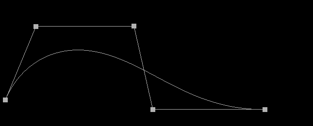
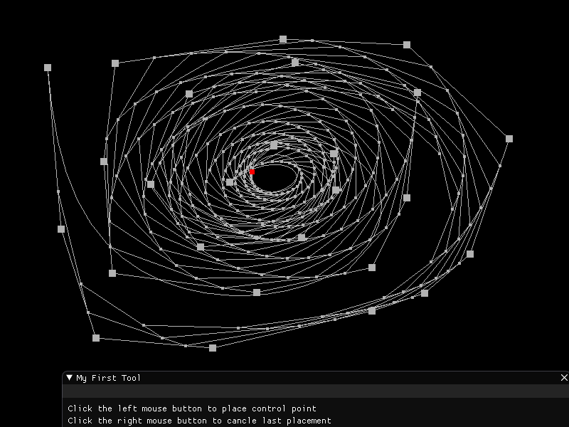
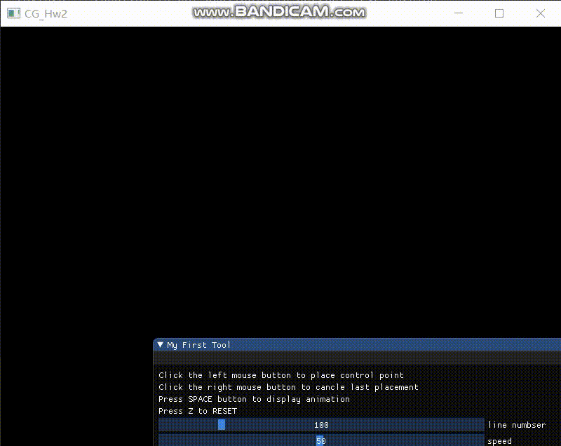

# Homework 9 - Bezier Curve

## Basic: 

1. 用户能通过左键点击添加Bezier曲线的控制点，右键点击则对当前添加的最后一个控制点进行消除 
2. 工具根据鼠标绘制的控制点实时更新Bezier曲线。 
Hint: 大家可查询捕捉mouse移动和点击的函数方法 

### 控制点增删

使用`glfwGetMouseButton`获取鼠标对应按键状态, 通过`glfwGetCursorPos`获取鼠标位置, 使用标志位`firstclick`防止抖动, 然后执行添加或删除控制点. 并更新Bezier曲线.

```c++
if (firstClick && glfwGetMouseButton(window, GLFW_MOUSE_BUTTON_LEFT) == GLFW_PRESS) {
  firstClick = false;
  playAnimation = false;
  glfwGetWindowSize(window, &windowWidth, &windowHeight);
  glfwGetCursorPos(window, &xPos, &yPos);
  controlPoints.push_back(glm::vec3(2 * xPos / windowWidth - 1, 1 - 2 * yPos / windowHeight, 0));
  // 重新计算
  curvePoints = drawBezier(controlPoints, amount);
}
else if (firstClick && glfwGetMouseButton(window, GLFW_MOUSE_BUTTON_RIGHT) == GLFW_PRESS) {
  firstClick = false;
  playAnimation = false;
  if (!controlPoints.empty()) {
    controlPoints.pop_back();
    // 重新计算
    curvePoints = drawBezier(controlPoints, amount);
  }
}else if (glfwGetMouseButton(window, GLFW_MOUSE_BUTTON_RIGHT) == GLFW_RELEASE 
  && glfwGetMouseButton(window, GLFW_MOUSE_BUTTON_LEFT) == GLFW_RELEASE) {
  firstClick = true;
}
```

### 绘制Bezier曲线

根据Bezier曲线的一般公式计算Bezier曲线的每一个插值点, 然后通过`amount`控制插值点数量

#### 一般参数公式

$$
B(t) = \sum\limits_{i=0}^{n}\binom{n}{1}P_i(1-t)^{n-i}t^i
$$

#### 代码

```c++
vector<glm::vec3> drawBezier(vector<glm::vec3> &cPoints, int amount) {
	vector<glm::vec3> pointsWithFactor, points;
	const int nums = cPoints.size();
  // 计算因子
	for (int i = 0; i < nums; i++) {
		auto temp = cPoints[i];
		temp *= cij(nums - 1, i);
		pointsWithFactor.push_back(temp);
	}
  // 计算插值点
	float step = 1 / static_cast<float>(amount);
	for (int i = 0; i <= amount; i++) {
		float t = i * step;
		glm::vec3 point(0);
		for (int j = 0; j < pointsWithFactor.size(); j++) {
			glm::vec3 temp = pointsWithFactor[j];
			temp *= pow(1 - t, nums - 1 - j) * pow(t, j);
			point += temp;
		}
		points.push_back(point);
	}
	return points;
}
// 计算组合数 c_i^j
int cij(int i, int j) {
	if (i < j) {
		return 0;
	}
	else if (i == j || j == 0) {
		return 1;
	}
	else {
		return cij(i - 1, j) + cij(i - 1, j - 1);
	}
}
```

#### 绘制

使用多条直线来插值Bezier曲线, 通过`amount`来控制直线数量. 因为要绘制多条直线, 所以在`shader.vs`中添加两个全局变量来获取直线的两个端点

顶点着色器, 通$t, t \in \{0, 1\}​$来判断顶点

```GLSL
#version 330 core
layout (location = 0) in float t;
uniform vec3 start;
uniform vec3 end;

void main()
{
	gl_Position = vec4((1-t) * start + t * end, 1.0);
}
```

渲染循环

```c++
for (int i = 0; i < curvePoints.size() - 1; i++) {
  pointOrLineShader.setVec3(curvePoints[i], "start");
  pointOrLineShader.setVec3(curvePoints[i + 1], "end");
  glDrawArrays(GL_LINES, 0, 2);
}
```

### 结果



## Bonus: 

1. 可以动态地呈现Bezier曲线的生成过程。 

### DeCasteljau算法

将`n`控制点依次相连的到`n-1`条线段, 在每一条线段上取一点$P'$, 使得$P_sP' : P_sP_e  = t : 1, t\in[0, 1]$, 这样就可以获得`n-1`个点, 将这`n-1`个点依次相连得到`n-2`条直线, 重复上述步骤. 直到只剩下1个点即为Bezier曲线参数为`t`时的点.

```c++
vector< vector<glm::vec3>> drawBezier(vector<glm::vec3> &cPoints, float step) {
	vector< vector<glm::vec3>> allPoints;
	vector<glm::vec3> currentPoints = cPoints;
	allPoints.push_back(currentPoints);
	if (step > 0 && step < 1) {
    // 递归计算控制点
		while (currentPoints.size() >= 2) {
			vector<glm::vec3> temp;
			for (int i = 0; i < currentPoints.size() - 1; i++) {
				glm::vec3 p(currentPoints[i] + step * (currentPoints[i + 1] - currentPoints[i]));
				temp.push_back(p);
			}
			currentPoints = temp;
			allPoints.push_back(currentPoints);
		}
	}
	return allPoints;
}
```

### 绘制

```c++
if (playAnimation) {
	// 控制播放速度和记录进度
  currentT = currentT + (deltaTime * speed) / (maxSpeed);
  points = drawBezier(controlPoints, static_cast<float>(currentT));

  glPointSize(4.0f);
  for (int i = 1; i < points.size() - 1; i++) {
    // 绘制每条直线上的控制点
    for (int j = 0; j < points[i].size(); j++) {
      pointOrLineShader.setVec3(points[i][j], "start");
      glDrawArrays(GL_POINTS, 0, 1);
    }
    // 绘制直线
    for (int j = 0; j < points[i].size() - 1; j++) {
      pointOrLineShader.setVec3(points[i][j], "start");
      pointOrLineShader.setVec3(points[i][j + 1], "end");
      glDrawArrays(GL_LINES, 0, 2);
    }
  }
	// 用红色标记Bezier曲线上的点
  if (points.size() > 1) {
    pointOrLineShader.setVec3(points[points.size()-1][0], "start");
    pointOrLineShader.setVec3(glm::vec3(1.0, 0, 0), "color");
    glPointSize(7.0f);
    glDrawArrays(GL_POINTS, 0, 1);
    pointOrLineShader.setVec3(glm::vec3(0.7), "color");
  }
}
```

### 添加GUI&优化操作

添加操作提示和控制插值数以及动画速度

```c++
ImGui::Text("Click the left mouse button to place control point");
ImGui::Text("Click the right mouse button to cancle last placement");
ImGui::Text("Press SPACE button to display animation");
ImGui::Text("Press Z to RESET");
ImGui::SliderInt("line numbser", &amount, 10, 500);
ImGui::SliderInt("speed", &speed, 1, maxSpeed);
```

使用`空格`播放动画, `Z`重置控制点

```c++
if (glfwGetKey(window, GLFW_KEY_SPACE) == GLFW_PRESS) {
  playAnimation = true;
  if (currentT > 0.1) {
    currentT = 0;
  }
}
if (glfwGetKey(window, GLFW_KEY_Z) == GLFW_PRESS) {
  controlPoints.clear();
  playAnimation = false;
}
```

### 结果



